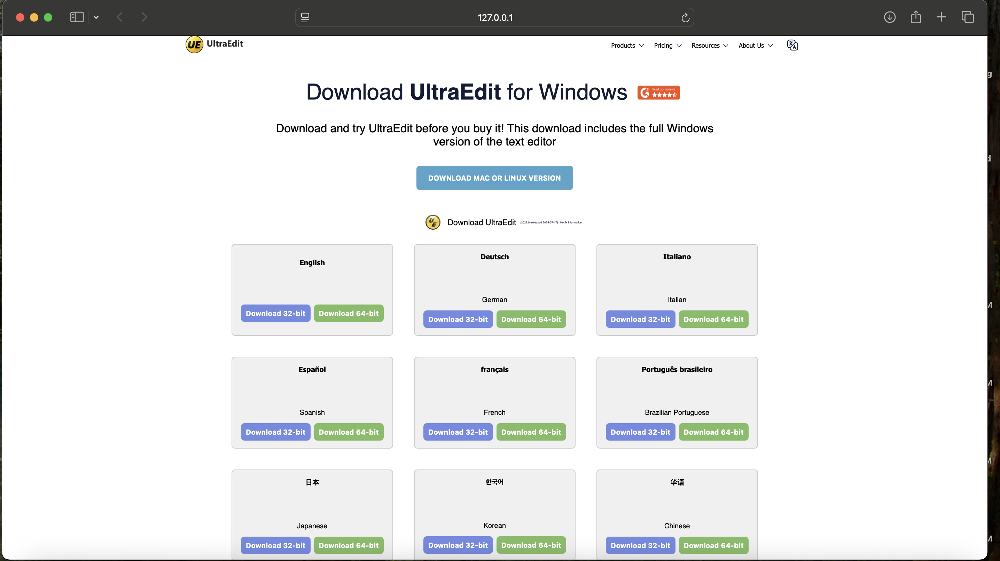

# UltraEdit Download Page Clone

This is a responsive front-end clone of the official UltraEdit download page, built using **HTML** and **CSS** only. It showcases a language-based download grid with 32-bit and 64-bit options for each supported language.

## 🚀 Features

- Responsive layout using CSS Flexbox and Grid
- Language-specific download tiles
- Download buttons for both 32-bit and 64-bit
- Clean and modern UI inspired by UltraEdit

## 📁 Project Structure
├── index.html         # Main HTML structure

├── style.css          # Styling with CSS Flex and Grid

├── image.png          # Screenshot of the web page

## 🛠️ Technologies Used
- HTML5
- CSS3 (Flexbox, Grid)

## 📷 Screenshot
Check out the live preview look below:

## 🧠 What I Learned
- Improved CSS layouting (flex & grid)
- Replicating a real-world landing page structure
- Responsive UI planning
- Clean class naming for maintainability.
